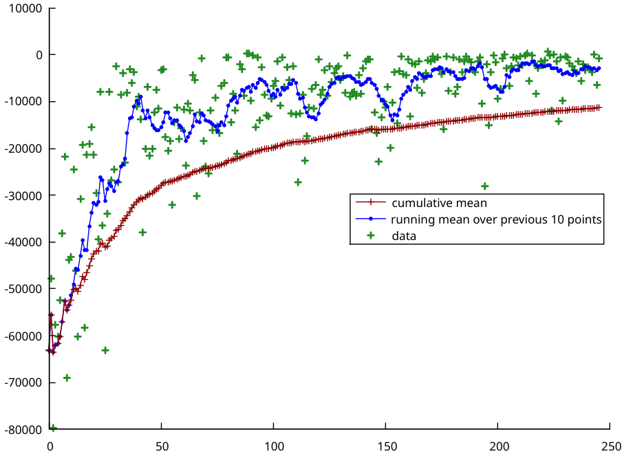

# About this project
This project contains my solutions for the exercises of the lecture Mobile Robots at the University of Applied Sciences Kempten in the summer term 2021 by Prof. Dr.-Ing. Jürgen Brauer.

This project goes beyond the scope of the exercises of this lecture and includes e.g. topics from the lecture Multimodal Sensor Systems.

Parts of this project are based on the solutions of Prof. Dr.-Ing. Jürgen Brauer. These can be found here: https://github.com/juebrauer (especially https://github.com/juebrauer/teaching_mobile_robots)
# Setup
requires libboost-dev libopencv-dev

# Project demo
In the following the self-driving scenario will be described. It's using most features this simulator currently have.

The following picture shows the simulation view. This is not what the simulated robot sees/knows. 
It represents the current state of the simulator.
The robot is represented as a red circle with a green line, representing its orientation. 
The blue lines are distance sensors measuring some noisy distance values. 
They are the only way the robot can detect his environment.
He does not have other sensors, nor he knows its location or orientation. The only other thing the robots knows is the map.

In this scenario the robot starts with random movements. 
The Operator used for this stage will only avoid crashing into walls (or unstuck if he hits a wall). 
This way the robot can collect some data required for the particle filter to locate the robot.

Over the first seconds the robot will utilize a particle filter to find his location in the known map.
Once he's certain he found his location he will calculate a path based on his estimated location to the target (in the bottom right corner of the map) with the A* algorithm.
The particle filter will continue to run, but now with way fewer particles.

The calculation for the path finding on this picture took ~200ms (400x400px). 
Calculating same path on the full map size (800x800px) with graphical output disabled takes around 300ms on a single core of my CPU (i7 8700k).

In the next step the robot calculates a list of waypoints based on the path found by A*.
Utilizing the estimated location and orientation the robot will start to navigate to the waypoints until he reaches the last one (the target).

# Other features
This might or might not be a complete list of further features ;)

## Q-Learning
Q-Learning is working, but would require some more work to be fully (and with good code quality) implemented.
The implemented algorithm targets on just driving around without colliding with walls (or stop otherwise from moving).

I tried two reward variants. 
The first variant (right version in the video) gives more reward if the robot moves further away from the spawn.
The second variant (left version) simply gives reward for the moved distance in the last tick (1/10 of a second).
The latter variant only drove circles. To compensate that problem I gave negative reward for turning in this variant.
In both variants there is a huge negative reward for not moving.

The simulation ran with an unlimited speed multiplier (-> as fast possible).

During training the rewards will be logged to the logs directory as a csv file. 
The logs directory also contains gnuplot file which can be used to plot the results.
You need the gnuplot library installed (not plotlib) and edit the filename set in example.gnuplot file.
Now run `gnuplot -p example.gnuplot` to get your log plotted.

## Value Iteration
Currently, there is an incomplete implementation of the Reinforcement learning algorithm _Value Iteration_.
The algorithm is working, but there are still some bugs and incomplete functions (eg the path calculation is incomplete).

On a map scaling of 2 (1/2 - 400x400 px) and without graphical output one iteration takes around 250ms. 
The code is not performance optimized, so there is plenty of room for improvement.

# Useful
## Other particle filter implementations
https://github.com/mjl/particle_filter_demo/tree/06c3c35e20df9e0d6e5d1d6eea861d51d8bba115

https://github.com/behnamasadi/Filters